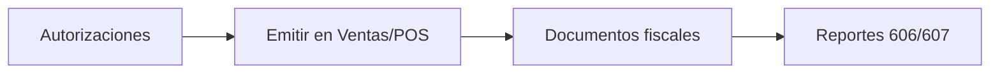

El módulo **Fiscal** concentra comprobantes electrónicos, autorizaciones ante la DGII y reportes de cumplimiento.

## Cómo está organizado

Esta página resume el módulo. En el menú lateral la primera sección suele ser **Autorizaciones**.

<Columns cols={2}>
  <Card title="Autorizaciones" icon="key" href="/fiscal/autorizaciones">
    Lotes y secuencias de NCF / e-CF.
  </Card>
  <Card title="Documentos fiscales" icon="file-lines" href="/fiscal/documentos-fiscales">
    Comprobantes emitidos por tu empresa.
  </Card>
  <Card title="Comprobantes recibidos" icon="inbox" href="/fiscal/comprobantes-recibidos">
    e-CF que otros te emitieron.
  </Card>
  <Card title="Gastos menores" icon="receipt" href="/fiscal/gastos-menores">
    Registro y emisión cuando aplique.
  </Card>
  <Card title="Recordatorios" icon="bell" href="/fiscal/recordatorios">
    Secuencias por agotarse e hitos fiscales.
  </Card>
  <Card title="Reportes" icon="chart-column" href="/fiscal/reportes">
    607, 606, retenciones e IT1 según tu menú.
  </Card>
</Columns>

## Por dónde empezar

<Steps>
  <Step title="Certificar e-CF (si aplica)">
    Guía de usuario: [Facturación electrónica](/introduccion/facturacion-electronica).
  </Step>
  <Step title="Cargar autorizaciones">
    Sin lotes activos no podrás emitir. Ver [Autorizaciones](/fiscal/autorizaciones).
  </Step>
  <Step title="Operar el mes">
    Emite desde Ventas/POS, revisa documentos y genera reportes al cierre.
  </Step>
</Steps>

<Warning>
  Antes de facturar en producción, confirma secuencias disponibles y que el certificado e-CF no esté vencido.
</Warning>
