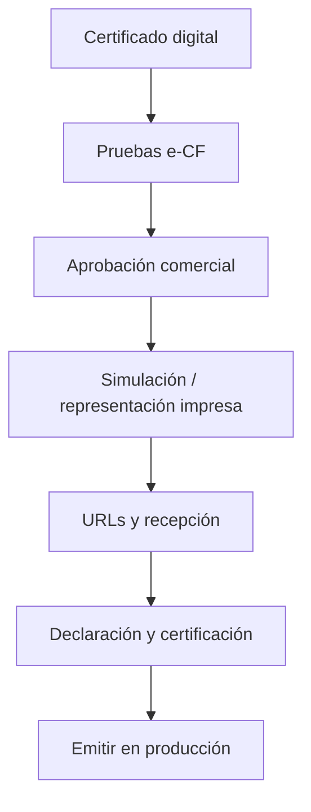

La **facturación electrónica (e-CF)** permite emitir comprobantes fiscales electrónicos ante la **DGII** (República Dominicana). Alante Digital guía la certificación y luego firma, envía y consulta cada comprobante.

<Warning>
  Esta página es la guía de usuario. Si integras un ERP externo por API, usa la [API de facturación electrónica](/api-facturacion-electronica).
</Warning>

## ¿Qué necesitas antes?

- Organización con RNC y datos fiscales correctos en [Configuración](/introduccion/configuracion)
- **Certificado digital** (.p12) vigente de la empresa
- Acceso de administrador a **Configuración → Facturación Electrónica**
- [Lotes / autorizaciones](/fiscal/autorizaciones) del tipo e-CF que vas a emitir (por ejemplo E31), cuando pases a operación real

## Dónde se configura

**Configuración → Facturación Electrónica**. El asistente avanza por etapas (certificado, pruebas, aprobación comercial, URLs, recepción, declaración, etc.). Completa cada paso en orden; el sistema indica el estado de certificación.

## Resumen de etapas (operador)

<Steps>
  <Step title="Subir certificado">
    Carga el .p12 y la contraseña. Mantén una copia segura fuera del sistema.
  </Step>
  <Step title="Identificación y ambiente de pruebas">
    Completa los datos que pide el asistente y ejecuta las pruebas contra el ambiente de la DGII.
  </Step>
  <Step title="Aprobación comercial y simulación">
    Gestiona aprobaciones y pruebas de representación impresa según el checklist del asistente.
  </Step>
  <Step title="Producción">
    Cuando la DGII y el asistente lo indiquen, pasa a producción. Desde entonces las emisiones reales quedan en [Documentos fiscales](/fiscal/documentos-fiscales).
  </Step>
</Steps>

## Operación diaria después de certificar

| Acción | Dónde |
| --- | --- |
| Emitir factura e-CF | [Ventas → Facturación](/ventas/facturacion) (Emitir) |
| Ver estado DGII | [Fiscal → Documentos fiscales](/fiscal/documentos-fiscales) |
| Notas de crédito electrónicas | [Notas de crédito](/ventas/notas-credito) |
| Lotes de secuencias | [Autorizaciones](/fiscal/autorizaciones) |
| API para otro sistema | [API e-CF](/api-facturacion-electronica) |

<Tip>
  Si un comprobante queda rechazado, revisa el mensaje de la DGII en el detalle del documento, corrige el dato (RNC, montos, ítems) y vuelve a emitir según el flujo permitido. No reutilices un eNCF ya consumido.
</Tip>

## Integraciones

- **API Keys**: Configuración → Integraciones — para sistemas externos.
- Ambiente de prueba **TesteCF sin persistencia**: documentado en la [API](/api-facturacion-electronica) (útil para integradores antes de tener lotes).

## Relacionado

- [Autorizaciones fiscales](/fiscal/autorizaciones)
- [Documentos fiscales](/fiscal/documentos-fiscales)
- [Reportes 607 / 606](/fiscal/reportes)
