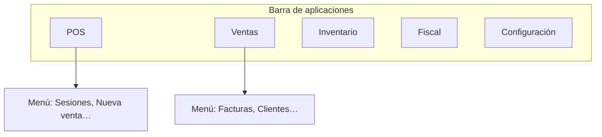

## Barra lateral de aplicaciones

A la izquierda verás los iconos de las **aplicaciones** (módulos) a las que tu organización te ha dado acceso. Al pasar el cursor sobre cada icono aparece el nombre del módulo.

Al elegir un módulo, se abre el **menú lateral** de ese módulo con sus secciones (por ejemplo Facturación, Clientes, Reportes en Ventas).

## Configuración y cierre de sesión

En la parte inferior de la misma barra encontrarás:

- **Configuración** de la organización (datos generales, branding, integraciones, etc.)
- **Cerrar sesión**

## Barra superior

En la parte superior de la pantalla suelen aparecer:

| Elemento | Para qué sirve |
| --- | --- |
| **Lista de tareas** | Pendientes y recordatorios que te competen |
| **Notificaciones** | Avisos del sistema (pagos, tickets, actividades…) |
| **Menú de usuario** | Tu cuenta y cambio de organización |
| **Calendario** | Compras a pagar, eventos, cumpleaños y tareas — [guía](/introduccion/calendario-y-tareas) |

## Buscador general (Cmd+K / Ctrl+K)

Desde cualquier pantalla abre la paleta con **Cmd+K** (Mac) o **Ctrl+K** (Windows).

### Acciones de creación

Escribe o selecciona para ir directo a crear, entre otras:

- Nueva factura, cotización o recibo de cobro
- Nuevo cliente, gasto, compra o recibo de pago a suplidor
- Nuevo producto, ticket de soporte u oportunidad CRM

### Navegación rápida

También puedes saltar a los tableros de Ventas, Inventario, Contabilidad, Cajas y Bancos, CRM, RRHH, Soporte y al **Centro de ayuda**.

<Tip>
  Solo ves las acciones de los módulos activos y para las que tu usuario tiene permiso. Escribe «factura», «gasto» o «inventario» para filtrar al instante.
</Tip>

Las búsquedas de registros existentes (clientes, facturas, productos…) funcionan en la misma paleta cuando escribes sin elegir una acción de creación.

## Módulos disponibles

Según tu plan y permisos:

| En el sistema | Para qué sirve |
| --- | --- |
| **Punto de Venta** | Cobrar en mostrador o caja con flujo rápido |
| **Restaurantes** | Mesas, cocina, menús y operación de comedor |
| **Ventas** | Facturas, cotizaciones, clientes, cobros y reportes |
| **Compras y Gastos** | Compras, gastos, pagos y reportes de egresos |
| **Inventario** | Productos, existencias, movimientos y costos |
| **Cajas y Bancos** | Cajas, bancos, pasarelas y conciliación |
| **Contabilidad** | Cuentas, diario, auxiliares y estados financieros |
| **Fiscal** | Autorizaciones DGII, comprobantes y reportes |
| **CRM** | Empresas, contactos, campañas y oportunidades |
| **Soporte** | Mesa de ayuda con tickets |
| **RRHH** | Empleados, nómina, vacaciones y TSS |
| **Proyectos** | Tablero, kanban, tareas y notificaciones |

Si no ves un módulo, puede deberse al rol o a que la organización no tiene contratada esa aplicación.

## Cambiar de organización

Si tu usuario está en varias empresas, usa el selector en el menú de usuario (arriba a la derecha). Cada organización tiene sus propios datos; al cambiar, verás solo la información de la empresa elegida.

