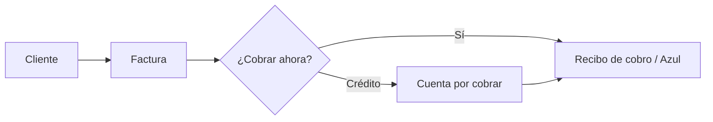

Esta guía te lleva del registro a la primera factura (o la primera venta en POS) con lo mínimo indispensable bien configurado.

## Checklist de arranque

<Steps>
  <Step title="Datos de la empresa">
    En **Configuración → Generales** completa razón social, RNC, dirección y contacto. Estos datos salen en facturas y reportes fiscales.
  </Step>
  <Step title="Branding">
    Sube logo y colores en **Configuración → Branding**. Si tienes varias marcas o sucursales, crea un branding por cada una.
  </Step>
  <Step title="Usuarios y roles">
    Invita al equipo y asigna roles con permisos claros (vendedor, cajero, contador…). Ver [Usuarios y roles](/introduccion/usuarios).
  </Step>
  <Step title="Inventario básico">
    Crea al menos un [almacén](/inventario/almacenes), [categorías](/inventario/categorias) y tus [productos o servicios](/inventario/productos).
  </Step>
  <Step title="Clientes y suplidores">
    Da de alta tus [clientes](/ventas/clientes) y [suplidores](/compras-y-gastos/suplidores), o impórtalos desde Excel.
  </Step>
  <Step title="Cajas y bancos">
    Configura la [caja](/cajas-y-bancos/cajas) del mostrador y las [cuentas bancarias](/cajas-y-bancos/bancos-y-movimientos) donde recibes pagos.
  </Step>
  <Step title="Fiscal (si aplica)">
    Carga [autorizaciones / lotes de NCF](/fiscal/autorizaciones). Si usas e-CF, sigue la [guía de facturación electrónica](/introduccion/facturacion-electronica).
  </Step>
  <Step title="Primera venta">
    Emite una [factura](/ventas/facturacion) o abre una [sesión de POS](/punto-de-venta/sesiones) y cobra tu primera venta.
  </Step>
</Steps>

## ¿Por dónde empiezo según mi negocio?

<Columns cols={2}>
  <Card title="Tienda o mostrador" icon="/images/icons/pos.svg" href="/punto-de-venta/tablero">
    Prioriza productos, caja, sesión POS y métodos de pago.
  </Card>
  <Card title="Restaurante" icon="/images/icons/restaurantes.svg" href="/restaurantes/configuracion">
    Configura sucursales, zonas, estaciones, menús y mesas antes del servicio.
  </Card>
  <Card title="Servicios / B2B" icon="/images/icons/ventas.svg" href="/ventas/facturacion">
    Enfócate en clientes, cotizaciones, facturas a crédito y cobros.
  </Card>
  <Card title="Operación completa" icon="/images/icons/contabilidad.svg" href="/contabilidad/tablero">
    Añade plan de cuentas, centros de costo y conciliación bancaria.
  </Card>
</Columns>

## Ejemplo rápido: primera factura

Imagina que vendes un servicio de consultoría a un cliente nuevo:

1. **Ventas → Clientes → Nuevo cliente** — nombre, RNC (si aplica) y correo.
2. **Ventas → Facturación → Nueva factura** — selecciona el cliente, agrega el servicio, revisa ITBIS.
3. Elige **Emitir factura** si ya tienes lotes fiscales activos; si no, guarda como borrador o factura interna según tu configuración.
4. **Envía por email** o genera el PDF. Si activaste [Link de Pago Azul](/introduccion/configuracion), el cliente puede pagar desde el enlace.

## Atajos útiles desde el día 1

| Acción | Cómo |
| --- | --- |
| Crear algo rápido | **Cmd+K** / **Ctrl+K** y escribe «nueva factura», «nuevo gasto», etc. |
| Cambiar de empresa | Menú de usuario (arriba a la derecha) → selector de organización |
| Ver pendientes | Icono de **tareas** en la barra superior |
| Calendario | Compras a pagar, eventos y tareas — [detalle](/introduccion/calendario-y-tareas) |

<Info>
  Si no ves un módulo, puede ser el plan de la licencia o el permiso de tu rol. Un administrador puede activarlo o asignártelo en Configuración.
</Info>
