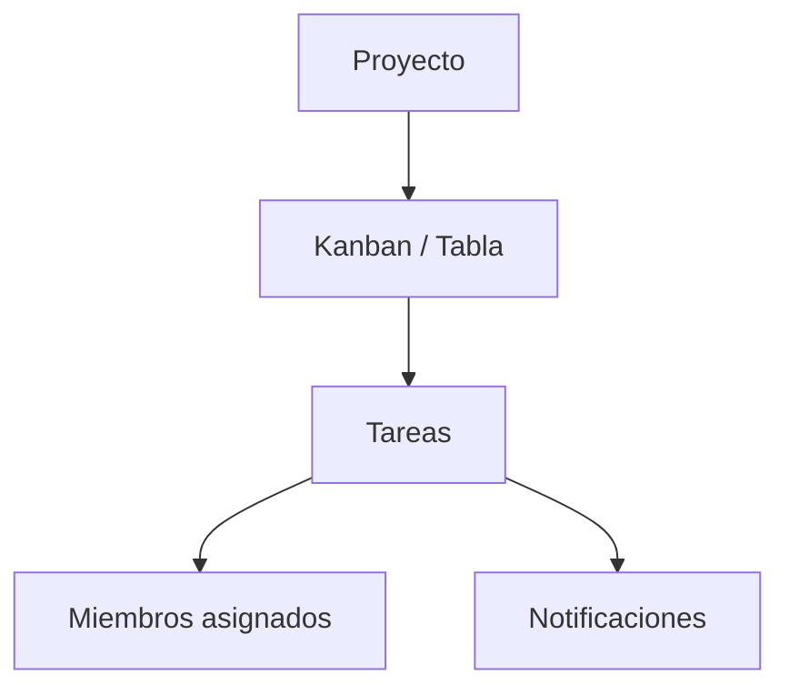

**Proyectos** organiza el trabajo por iniciativas: tablero, kanban o tabla, miembros, etiquetas y notificaciones.

## Guías de este módulo

<Columns cols={2}>
  <Card title="Crear y gestionar" icon="folder-plus" href="/proyectos/crear-y-gestionar">
    Alta de proyectos, archivo y vistas principales.
  </Card>
  <Card title="Tareas y Kanban" icon="table-columns" href="/proyectos/tareas-kanban">
    Columnas, arrastrar tareas, tabla y actividad.
  </Card>
  <Card title="Miembros y etiquetas" icon="users" href="/proyectos/miembros-y-etiquetas">
    Equipo del proyecto y etiquetas de clasificación.
  </Card>
  <Card title="Mis tareas y avisos" icon="bell" href="/proyectos/mis-tareas-y-notificaciones">
    Pendientes personales y notificaciones.
  </Card>
</Columns>

## Tablero

Resumen del estado de los proyectos y actividad reciente. Ideal para empezar el día o la reunión semanal.

## Relación con la lista global de tareas

La **lista de tareas** de la barra superior y el [calendario](/introduccion/calendario-y-tareas) incluyen pendientes generales (y actividades de clientes). **Mis tareas** de Proyectos se centra en el trabajo por iniciativa.

