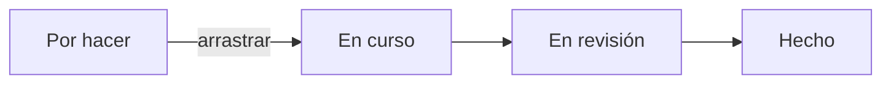

## Vista Kanban

Dentro de un proyecto, la vista **Kanban** muestra columnas (estados). Arrastra tarjetas entre columnas para actualizar el estado.

### Buenas prácticas de columnas

Mantén un flujo simple:

1. Por hacer  
2. En curso  
3. En revisión (opcional)  
4. Hecho  

Evita multiplicar columnas: cada una debe significar una decisión clara del equipo.

## Crear y editar tareas

En cada tarea puedes:

- Asignar **uno o varios responsables**
- Definir fechas
- Escribir descripción y **comentarios**
- Aplicar **etiquetas**
- Completar o **archivar** la tarea
- Reordenar dentro de la columna

## Vista Tabla

La vista **Tabla** lista las mismas tareas en filas: útil para revisar muchas a la vez, filtrar o actualizar campos sin arrastrar.

## Actividad (bitácora)

En **Actividad** del proyecto ves el historial de cambios (quién movió qué, comentarios recientes). Sirve para auditorías ligeras y para poner al día a quien se incorpora.

<Info>
  Las tareas asignadas a ti también aparecen en [Mis tareas](/proyectos/mis-tareas-y-notificaciones).
</Info>
