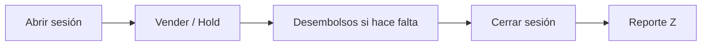

El **Punto de venta (POS)** está pensado para cobrar en persona: buscar productos, cobrar con varios medios, gestionar el turno de caja y emitir el comprobante.

## Qué incluye este módulo

<Columns cols={2}>
  <Card title="Tablero" icon="layout-dashboard" href="/punto-de-venta/tablero">
    Ventas del día, sesión activa, stock bajo y órdenes en hold.
  </Card>
  <Card title="Sesiones de caja" icon="clock" href="/punto-de-venta/sesiones">
    Abrir, suspender, cerrar turno, desembolsos y reporte Z.
  </Card>
  <Card title="Nueva venta" icon="cart-shopping" href="/punto-de-venta/nueva-venta">
    Carrito, pagos, crédito, hold e integración con restaurantes.
  </Card>
  <Card title="Favoritos y cortesías" icon="star" href="/punto-de-venta/favoritos-y-cortesias">
    Accesos rápidos y descuentos de cortesía controlados.
  </Card>
  <Card title="Reportes" icon="chart-column" href="/punto-de-venta/reportes">
    Ventas, propina legal y reportes por sesión.
  </Card>
</Columns>

## Flujo típico de un turno

<Steps>
  <Step title="Abrir sesión">
    Elige caja y monto inicial. Sin sesión activa no puedes vender. Detalle en [Sesiones](/punto-de-venta/sesiones).
  </Step>
  <Step title="Cobrar">
    Usa **Nueva venta**, agrega productos y cobra con uno o varios métodos. Guía: [Nueva venta](/punto-de-venta/nueva-venta).
  </Step>
  <Step title="Cerrar el turno">
    Arquea el efectivo (ciego o con esperado, según configuración) y consulta el reporte Z.
  </Step>
</Steps>

## Relación con otros módulos

| Módulo | Cómo se conecta |
| --- | --- |
| [Inventario](/inventario/tablero) | Descuenta stock en tiempo real; recetas y modificadores en el carrito |
| [Cajas y Bancos](/cajas-y-bancos/cajas) | La sesión opera sobre una caja; alertas de límite de efectivo |
| [Ventas](/ventas/facturacion) | Puedes cobrar facturas a crédito pendientes desde el POS |
| [Restaurantes](/restaurantes/tablero) | Enviar a cocina o cobrar mesas/cuentas |
| [RRHH](/recursos-humanos/nominas) | Propina legal y novedades de nómina, si aplica |

<Tip>
  En **Configuración → Punto de Venta** defines pie de ticket, copias de impresión, correos de cierre y si el cajero ve el efectivo esperado.
</Tip>
