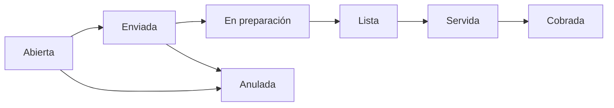

## Mapa de mesas

En **Restaurantes → Mesas** ves el plano filtrable por zona. Cada mesa muestra su estado (libre, ocupada, etc.).

### Abrir una mesa

1. Selecciona una mesa libre.
2. Indica comensales y mesero (si aplica).
3. Agrega productos del menú, notas por plato y modificadores.
4. **Envía a cocina** cuando el pedido esté listo para preparar.

Puedes seguir agregando ítems después (otra ronda) y volver a enviar.

## Separar cuentas

Cuando varios comensales pagan por separado en la misma mesa:

<Steps>
  <Step title="Activar separación">
    En la mesa u orden, activa cuentas independientes (Cuenta 1, Cuenta 2…).
  </Step>
  <Step title="Asignar productos">
    Mueve ítems entre cuentas o asígnalos al crearlos.
  </Step>
  <Step title="Pre-cuenta">
    Imprime o muestra la **pre-cuenta** de cada cuenta.
  </Step>
  <Step title="Cobrar">
    Envía cada cuenta a [cobro en POS](/restaurantes/cobro-con-pos).
  </Step>
</Steps>

<Tip>
  Útil cuando alguien se va antes o cuando dividen la cuenta por persona o por grupo.
</Tip>

## Estados de la orden (resumen)

La anulación sigue el flujo auditado del sistema (a veces con OTP / autorización desde POS).

## Ejemplo

Mesa 8 pide tres platos. Dos amigos quieren pagar aparte el postre:

1. Se crean **Cuenta A** (comida) y **Cuenta B** (postres).
2. Se imprime pre-cuenta B; cobran en POS y liberan solo esa parte.
3. Al final cobran Cuenta A y la mesa queda libre.
