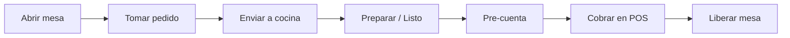

El módulo **Restaurantes** cubre el servicio en mesas: configuración del local, toma de pedidos, cocina (KDS) y cobro (incluido separar cuentas).

## Guías de este módulo

<Columns cols={2}>
  <Card title="Configuración inicial" icon="gears" href="/restaurantes/configuracion">
    Sucursales, zonas, estaciones, menús y mesas.
  </Card>
  <Card title="Mesas y cuentas" icon="chair" href="/restaurantes/mesas-y-cuentas">
    Abrir mesa, tomar orden, separar cuentas y pre-cuenta.
  </Card>
  <Card title="Cocina (KDS)" icon="fire-burner" href="/restaurantes/cocina">
    Estaciones, estados de platos e impresión de comanda.
  </Card>
  <Card title="Cobro con POS" icon="cash-register" href="/restaurantes/cobro-con-pos">
    Enviar a cobro, liberar mesa e integración fast-food.
  </Card>
</Columns>

## Tablero

El tablero muestra órdenes activas, ocupación y accesos rápidos a mesas y cocina. Úsalo al inicio del turno para ver el estado del salón.

## Flujo del servicio

<Tip>
  Configura estaciones y menús **antes** del fin de semana pico. Sin menú y mesas listos, el mapa operativo no sirve en alta demanda.
</Tip>
