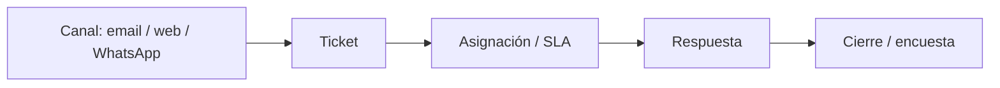

**Soporte** es la mesa de ayuda de tu organización: tickets por email, web o WhatsApp, base de conocimientos, automatizaciones, SLAs y reportes.

## Guías de esta sección

<Columns cols={2}>
  <Card title="Tickets" icon="ticket" href="/soporte/tickets">
    Crear, asignar, responder y cerrar casos.
  </Card>
  <Card title="Agentes y clientes" icon="user-group" href="/soporte/agentes-y-clientes">
    Quién atiende y quién es el contacto.
  </Card>
  <Card title="Base de conocimientos" icon="book" href="/soporte/base-conocimientos">
    Artículos para autoservicio y respuestas rápidas.
  </Card>
  <Card title="Automatización y SLAs" icon="bolt" href="/soporte/automatizacion-y-sla">
    Reglas, prioridades y tiempos de respuesta.
  </Card>
  <Card title="WhatsApp" icon="whatsapp" iconType="brands" href="/soporte/whatsapp">
    Plantillas y ventana de 24 horas.
  </Card>
  <Card title="Canales" icon="gears" href="/soporte/configuracion-canales">
    Email, WhatsApp, encuestas e IA.
  </Card>
</Columns>

También: [Reportes de soporte](/soporte/reportes).

## Flujo típico

<Tip>
  Define etiquetas, prioridades y SLAs **antes** de abrir el canal al público. Documenta en la base de conocimientos lo que más se repite.
</Tip>
