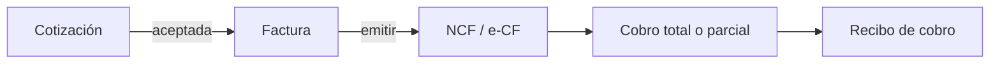

Facturar en Alante Digital es rápido y seguro: el sistema guía cada paso, calcula impuestos y deja el documento listo para imprimir, enviar o cobrar.

## Antes de comenzar

Ten a mano:

- El cliente (nombre, RNC o teléfono)
- Los productos o servicios
- El tipo de comprobante / NCF que vas a emitir
- Lotes activos en [Autorizaciones](/fiscal/autorizaciones) si emites fiscalmente

## Crear una factura

<Steps>
  <Step title="Abrir el formulario">
    Ve a **Ventas → Facturación → Nueva factura**.
  </Step>
  <Step title="Cliente y fechas">
    Selecciona o crea el cliente. Define emisión y vencimiento (si es a crédito).
  </Step>
  <Step title="Condición de pago">
    Elige crédito o contado.
  </Step>
  <Step title="Líneas">
    Agrega productos o servicios, descuentos e ITBIS. Revisa totales.
  </Step>
  <Step title="Guardar o emitir">
    Usa borrador, guardar o emitir según el caso (tabla siguiente).
  </Step>
</Steps>

## Opciones de guardado

| Opción | Cuándo usarla |
| --- | --- |
| **Guardar como borrador** | Aún te faltan datos |
| **Guardar factura** | Registra la venta sin emitir fiscalmente (según tu configuración) |
| **Emitir factura** | Genera el comprobante fiscal válido (NCF / e-CF) |

## Acciones en el detalle

Después de guardar puedes:

- **Aplicar pagos** (o usar [recibos de cobro](/ventas/recibos-cobro))
- **Imprimir / PDF**
- **Enviar por email**
- **Editar o eliminar** (si no está emitida / según reglas)
- **Aplicar nota de crédito** — [guía](/ventas/notas-credito)

## Ejemplo: factura a crédito con cobro parcial

1. Cliente “Distribuidora Norte”, crédito 30 días.
2. Facturas RD$50,000 + ITBIS.
3. Emiten el comprobante y envían el PDF.
4. A los 10 días registran un [recibo de cobro](/ventas/recibos-cobro) de RD$20,000; el saldo queda en cuentas por cobrar.
5. El cliente paga el resto con [Link de Pago Azul](#link-de-pago-con-azul-dominicana) desde el correo.

## Link de pago con Azul Dominicana

Si tu organización tiene activo el **Link de Pago de Azul Dominicana**, el cliente puede pagar facturas pendientes con tarjeta desde el correo o la **vista pública**.

### Configuración

1. **Configuración → Integraciones → Link de Pago Azul**
2. Activa el botón en facturas públicas
3. Merchant ID, Private Key, moneda y [pasarela](/cajas-y-bancos/pasarelas-de-pago) de destino
4. (Opcional) email de aviso al aprobar pagos

Requiere contrato de Link de Pago / Payment Page con Azul. No es lo mismo que el cobro con tarjeta 3DS del Punto de Venta.

### Qué ocurre al pagar

- El cliente va a la página segura de Azul
- Al aprobar, Alante registra un **recibo de cobro** automáticamente
- El equipo puede recibir email según configuración

Solo aplica a facturas con saldo pendiente y moneda compatible.

## Branding y pie de factura

Si manejas varias marcas:

- Selecciona el **Branding** del documento
- Personaliza el **pie de factura** cuando lo necesites

## Facturación electrónica

Si ya certificaste e-CF, al **emitir** el sistema firma y envía a la DGII. Estado y XML/PDF: [Documentos fiscales](/fiscal/documentos-fiscales). Guía de certificación: [Facturación electrónica](/introduccion/facturacion-electronica).

<Tip>
  ¿Vienes de una cotización? Ábrela y conviértela en factura con un clic — [Cotizaciones](/ventas/cotizaciones).
</Tip>
